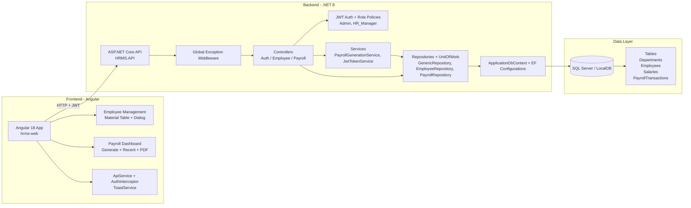

# HRMS - System Setup and Architecture

This repository contains an HRMS solution with:

- .NET 8 Web API using Clean Architecture and EF Core (Code First)
- JWT authentication with role-based authorization
- Angular 18 frontend with standalone components and Angular Material

## System Architecture (Mermaid)



## Project Structure

- src/HRMS.Domain: Entities and core domain models.
- src/HRMS.Application: Interfaces and application contracts.
- src/HRMS.Infrastructure: EF Core, repositories, services, and persistence.
- src/HRMS.API: Web API host, controllers, middleware, auth configuration.
- hrms-web: Angular frontend app.

## Prerequisites

- .NET SDK 8.x
- Node.js 20+
- npm 10+
- SQL Server or LocalDB

## 1) Database Setup

### Configure connection string

Edit the connection string in [src/HRMS.API/appsettings.json](src/HRMS.API/appsettings.json):

- ConnectionStrings:DefaultConnection

### Apply migrations

Run from repository root:

```powershell
dotnet ef database update --project src/HRMS.Infrastructure/HRMS.Infrastructure.csproj --startup-project src/HRMS.API/HRMS.API.csproj --context ApplicationDbContext
```

If you need to create a new migration:

```powershell
dotnet ef migrations add <MigrationName> --project src/HRMS.Infrastructure/HRMS.Infrastructure.csproj --startup-project src/HRMS.API/HRMS.API.csproj --context ApplicationDbContext --output-dir Persistence/Migrations
```

## 2) Run the .NET API

From repository root:

```powershell
dotnet restore HRMS.sln
dotnet build HRMS.sln
dotnet run --project src/HRMS.API/HRMS.API.csproj
```

Default API base URL is typically:

- https://localhost:5001

Swagger (Development):

- https://localhost:5001/swagger

## 3) Start the Angular App

From [hrms-web](hrms-web):

```powershell
npm install
npm start
```

Angular app default URL:

- http://localhost:4200

API base URL for frontend is configured in [hrms-web/src/environments/environment.ts](hrms-web/src/environments/environment.ts).

## Authentication and Roles

JWT settings and demo users are in [src/HRMS.API/appsettings.json](src/HRMS.API/appsettings.json):

- Jwt section: Issuer, Audience, Key, ExpiresInMinutes
- AuthUsers section:
   - Admin
   - HR_Manager

Login endpoint:

- POST /api/auth/login

Payroll endpoints are protected and require HR_Manager role.

## Key Implemented Modules

- Employee Management (Angular Material table, sorting/filtering, add/edit dialog).
- Payroll Dashboard (generate monthly payroll, recent payments list, export payslip PDF).
- Global API exception handling for consistent error responses.
- Repository Pattern + Unit of Work in backend.

## Troubleshooting

- If JWT requests fail with 401:
   - Verify token is present in local storage and interceptor attaches Authorization header.
   - Verify Jwt settings (issuer/audience/key) match token generation and validation.
- If database update fails:
   - Recheck connection string and SQL Server/LocalDB availability.
- If Angular build shows budget warnings:
   - This is currently expected with Material + PDF dependencies; app still builds and runs.
